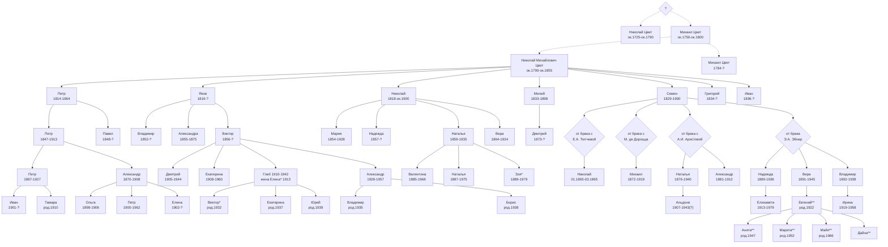

# Родословная семьи М.С.Цвета

```mermaid
graph TD
    Root{"?"} -.-> N1["Николай Цвет<br>ок.1725-ок.1790"]
    Root -.-> M1["Михаил Цвет<br>ок.1750-ок.1800"]
    
    M1 -.-> NM["Николай Михайлович Цвет<br>ок.1790-ок.1855"]
    M1 -.-> M2["Михаил Цвет<br>1784-?"]

    NM --> P1["Петр<br>1814-1864"]
    NM --> Y1["Яков<br>1816-?"]
    NM --> N2["Николай<br>1818-ок.1900"]
    NM --> Mil["Милий<br>1833-1898"]
    NM --> Sem["Семен<br>1829-1900"]
    NM --> Gr["Григорий<br>1834-?"]
    NM --> Iv1["Иван<br>1836-?"]

    %% Ветвь Петра
    P1 --> P2["Петр<br>1847-1913"]
    P1 --> Pav["Павел<br>1848-?"]
    P2 --> P3["Петр<br>1867-1927"]
    P2 --> Al1["Александр<br>1870-1908"]
    P3 --> Iv2["Иван<br>1901-?"]
    P3 --> Tam["Тамара<br>род.1910"]
    Al1 --> Ol1["Ольга<br>1898-1906"]
    Al1 --> P4["Петр<br>1900-1962"]
    Al1 --> El1["Елена<br>1902-?"]

    %% Ветвь Якова
    Y1 --> Vl1["Владимир<br>1852-?"]
    Y1 --> Ale["Александра<br>1855-1875"]
    Y1 --> Vik1["Виктор<br>1856-?"]
    Vik1 --> Dm1["Дмитрий<br>1905-1944"]
    Vik1 --> Ek1["Екатерина<br>1908-1960"]
    Vik1 --> Gl["Глеб 1910-1942<br>жена Елена* 1913"]
    Vik1 --> Al2["Александр<br>1928-1957"]
    Gl --> Vik2["Виктор*<br>род.1932"]
    Gl --> Ek2["Екатерина<br>род.1937"]
    Gl --> Yur["Юрий<br>род.1939"]
    Al2 --> Vl2["Владимир<br>род.1935"]
    Al2 --> Bor["Борис<br>род.1938"]

    %% Ветвь Николая
    N2 --> Mar["Мария<br>1854-1928"]
    N2 --> Nad1["Надежда<br>1857-?"]
    N2 --> Nat1["Наталья<br>1859-1935"]
    N2 --> Ver1["Вера<br>1864-1924"]
    Nat1 --> Val["Валентина<br>1885-1968"]
    Nat1 --> Nat2["Наталья<br>1887-1975"]
    Nat1 --> Zoya["Зоя*<br>1889-1979"]

    %% Ветвь Милия
    Mil --> Dm2["Дмитрий<br>1873-?"]

    %% Ветвь Семена (с браками)
    Sem --> B_Tyutcheva{"от брака с<br>Е.А. Тютчевой"}
    B_Tyutcheva --> N3["Николай<br>01.1865-03.1865"]
    
    Sem --> B_Dorozza{"от брака с<br>М. де Дороцца"}
    B_Dorozza --> M3["Михаил<br>1872-1919"]
    
    Sem --> B_Aristova{"от брака с<br>А.И. Аристовой"}
    B_Aristova --> Nat3["Наталья<br>1876-1940"]
    B_Aristova --> Al3["Александр<br>1881-1912"]
    Nat3 --> Ald["Альдоне<br>1907-1943(?)"]

    Sem --> B_Ebner{"от брака<br>Э.А. Эбнер"}
    B_Ebner --> Nad2["Надежда<br>1889-1936"]
    B_Ebner --> Ver2["Вера<br>1891-1945"]
    B_Ebner --> Vl3["Владимир<br>1892-1938"]
    Nad2 --> Eliz["Елизавета<br>1913-1979"]
    Ver2 --> Evg["Евгений**<br>род.1922"]
    Vl3 --> Ir["Ирина<br>1919-1958"]
    
    Evg --> Ani["Анита**<br>род.1947"]
    Evg --> Mari["Марита**<br>род.1952"]
    Evg --> Maya["Майя**<br>род.1966"]
    Evg --> Dai["Дайна**"]
```