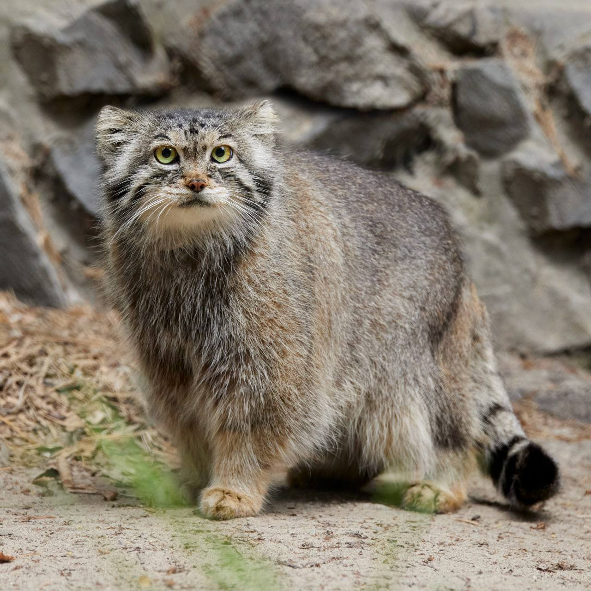

# Наш современник — М.С.Цвету

*Время не губит гения, но гений торжествует над временем.*  
**В.Г.Белинский**

Как мало признательности выпало на долю Цвета при жизни! Лишь одна академическая премия была присуждена ему в 1911 г. за научный труд «Хромофиллы в растительном и животном мире». Такие же награды, как ордена св.Станислава 3-й степени в 1907 г., св.Анны 3-й степени в 1912 г., св.Станислава 2-й степени в 1915 г. и медаль в честь 300-летия дома Романовых в 1913 г. он получил «в воздаяние отлично-усердной службы», как, впрочем, и другие преподаватели варшавских вузов, особо отмеченные за трудность работы на далекой окраине России. Вот и все, чем суровое Отечество отметило заслуги бескорыстно отдавшего ей весь свой незаурядный талант исследователя и педагога, поставив его в ряд с обычными государственными чиновниками.

  
**Царский рескрипт о награждении 1 мая 1915 г. Коллежского советника Михаила Цвета орденом Святого Станислава второй степени**

Правда, было еще признание немногих зарубежных коллег, выдвинувших в 1918 г. кандидатуру Цвета на присуждение ему Нобелевской премии за исследования хлорофилла, но, как уже отмечалось выше (см. с. 297), этой наградой удостоили другого претендента, о котором теперь даже историки химии вряд ли смогут вспомнить. Да, их было совсем немного, кто при жизни Цвета должным образом оценил его открытие, но никто, в том числе и сам автор, не предполагал, какое огромное влияние окажет оно на развитие биохимии, химии и химической технологии уже через немногие годы после его кончины.

Плодотворное использование хроматографии в ряде лабораторий с начало, 30-х годов при получении и очищении биологически активных веществ и других химических соединений настолько расположило к ней исследователей, что в 1936 г. появились публикации в честь 30-летия этого метода (В.Стикс, 1936; Zechmeister L., Cholnoky L., 1936, 1936a), хотя почти все те, кто им пользовался тогда, знали о нем не более пяти лет.

Вскоре на немецком, французском и английском языках появился ряд монографий о методе хроматографического анализа (Zechmeister L., Cholnoky L., 1937, 1938, 1943; Willstaedt H., 1938; Vetter H., 1939; Cook A., 1941; Starain H.H., 1942; Williams T.I., 1946), авторы которых единодушно давали ему высокую оценку и усматривали в нем большие возможности. Член Лондонского Королевского общества профессор химии Хэйльброн в заключительных словах предисловия к книге Цехмейстера и Челноки в английском переводе выразил надежду, что после знакомства с нею возникнет «еще более сильное стремление к внедрению этой очаровательной техники, имеющей неоценимые заслуги в различных областях органической и биологической химии» (см. Zechmeister L., Cholnoky L., 1943, p.VII). Отдавая должное методу, авторы не забывали и о его создателе, хотя и не могли сказать что-либо о нем самом. Лишь обстоятельный очерк швейцарского биохимика растений Ш.Дере (Dhéré Ch., 1943) существенно пополнил сведения об исследованиях Цвета, связанных с растительными пигментами, и о начальном этапе его творческого пути в Женеве, значившиеся в единственной биобиблиографической публикации о Цвете из справочника о женевских ботаниках (Briquet J., 1940).

Научная общественность не оставила без внимания также и 40-летие хроматографии. Этой дате была посвящена конференция, проведенная 29—30 ноября 1946 г. секцией физики и химии Нью-Йоркской Академии наук. Примечательно, что в числе участников конференции было немало представителей той школы немецких химиков, которая в свое время так много сделала для дискредитации и забвения метода Цвета. Эмигрировав в годы второй мировой войны из гитлеровской Германии, они приняли участие в реализации «Проекта Манхеттена» и «Плутониевого проекта» по получению редкоземельных металлов и выделению в чистом виде продуктов атомного расщепления. Теперь химики той же школы свидетельствовали, что решение проблемы радиоактивных веществ было бы невозможно без того самого метода, который так долго игнорировался и до 30-х годов не мог занять в науке заслуженное место.

После снятия грифа секретности с этих работ в послевоенные годы участники конференции могли рассказать о своих исследованиях, выполненных преимущественно с помощью ионообменной хроматографии. Их сообщения были своего рода иллюстрацией к первому докладу конференции, сделанному Цехмейстером, также эмигрировавшим в США из Венгрии.

Высоко оценивший открытие Цвета в начале 30-х годов на опыте своих исследований, докладчик изложил основные положения его работ, успешные результаты их использования коллегами, осветил широкие возможности применения в науке и технологии, а также осудил все еще продолжающуюся недооценку хроматографии промышленными кругами, не обеспечивающих хроматографистов необходимым оборудованием. Позже этот доклад был опубликован в «Анналах Нью-Йоркской Академии наук» (Zechmeister L., 1948) как и другие сообщения, сделанные на конференции.

Одновременно интерес к Цвету возрастал и у его соотечественников, чему в немалой мере способствовал рост патриотических настроений в годы Великой Отечественной войны, а после ее окончания — усиление внимания к истории науки. Последнее побудило Академию наук СССР приступить к изданию в серии «Классики науки» таких научных трудов, которые в прошлом оказали существенное влияние на развитие человеческих знаний. Одно из первых таких изданий в 1946 г. составили избранные работы Цвета, а само издание называлось «Хроматографический адсорбционный анализ» (Цвет М.С., 1946, №70). Оно включало в себя публикации автора о хроматографии, относящиеся к 1903, 1906 и 1910 гг. и ставшие к 40-м годам библиографической редкостью. В данном издании были представлены также первая в отечественной литературе краткая биография Цвета, составленная А.А.Рихтером и Т.А.Красносельской (1946), их статья о роли трудов Цвета в создании хроматографического метода и очерк Б.Я.Свешникова (1946) о достижениях хроматографии тех лет со времен Цвета.

Заслуги Цвета особо отметил президент Академии наук СССР академик С.И.Вавилов (1947, 1949) на I Всесоюзной конференции по фотосинтезу (Москва, 22—26 октября 1946 г.) и на сессии Академии наук, посвященной истории отечественной науки (Москва, 5—11 января 1949 г.). Тогда же появилась статья о 75-летии со дня рождения Цвета (Свешников Б.Я., 1947).

Такая позиция официальной науки способствовала ускоренному возрождению памяти о Цвете в его Отечестве, где до 40-х годов относились с осторожностью к работникам науки и просвещения непролетарского происхождения, к тому же тесно связанным в своей жизни и деятельности с зарубежными странами, хотя бы и в дореволюционные годы. С середины 40-х годов положение изменилось. Успехам и приоритетам отечественной науки в прошлом стали уделять особое внимание, в связи с чем в системе Академии наук СССР в 1945 г. был создан Институт истории естествознания (с 1953 г. — Институт историй естествознания и техники) «с задачей разработки истории мирового и особенно русского естествознания, хранения и публикации научного наследства классиков русской науки» [1]. Институт участвовал в издании вышеназванной серии «Классики науки» и в том числе избранных работ Цвета, а его сотрудники (Poliakov I.A., 1948; Х.С.Коштоянц и К.Ф.Калмыков, 1951, 1953.; Е.М.Сенченкова, 1973; Kara-Murza S.G., 1985) активизировали обсуждение вопросов о приоритете и дате открытия хроматографии русским ученым. Теперь стоит признать, что такая активность была лишь данью уже минувшему времени, а творчество Цвета — достояние общемировое, как и сама его жизнь, волею судеб связанная не только с Россией.

К сожалению, в России использование открытия славного россиянина после его кончины существенно отставало от западных стран. Лишь после завершения второй мировой войны и налаживания должной связи с зарубежной наукой этот разрыв стал постепенно сокращаться. Свидетельством установления плодотворных контактов химиков по использованию метода Цвета может служить выход первой русской монографии на эту тему — сборника статей «Хроматография» (М., Изд-во ИЛ, 1949. 236 стр.), представляющего собой перевод с английского языка докладов, прочитанных на упомянутой выше конференции по хроматографии в Нью-Йорке. За ним сразу же вторым выпуском появился сборник статей «Хроматографический метод разделения ионов» (М., Изд-во ИЛ, 1949. 400 стр.) с участием отечественных и зарубежных авторов. Оба сборника открывались статьями, посвященными Цвету и его методу. В первом случае это был доклад Цехмейстера (1949) о 40-летии хроматографии, во втором — обстоятельный очерк Е.Н.Гапона и Т.Б.Гапон (1949) о развитии ими идей Цвета при разработке своего нового вида хроматографии, который они назвали осадочной хроматографией.

В обоих случаях статьи начинались с исторической части, где излагалось основное содержание работ Цвета, открывших не только новый принцип в методах исследования, но и совершенно оригинальное научное направление. Различие было лишь во взгляде авторов на дату отсчета этих нововведений. Цехмейстер называл «днем рождения хроматографии» 1906 г. (Цехмейстер Л., 1949, с.8), а супруги Гапоны считали таковым 1903 г. В предисловии к первому сборнику академик М.М.Дубинин (1949) вслед за И.В.Тананаевым (1941) и И.А.Поляковым (Poliakov I.A., 1948) также заметил Цехмейстеру об открытии Цветом хроматографии в 1903 г. Одновременно Дубинин резко отреагировал на ту часть статьи, где Цехмейстер называл предшественников Цвета по созданию хроматографии, усмотрев в этом посягательство на приоритет открытия данного метода русским ученым.

Таким образом, к 50-летию метода Цвета научный мир пришел двумя путями. Соотечественники ученого отмечали этот юбилей в 1953 г., тогда как зарубежные хроматографисты вели отсчет от 1906 г. и для них юбилейной датой стал 1956 год.

По инициативе Института геохимии и аналитической химии им. В.И.Вернадского и при участии Комиссии по хроматографии при ОХН АН СССР 18—21 ноября 1953 г. в Москве состоялось совещание по применению хроматографического метода Цвета в химическом анализе. В многочисленных докладах и при их обсуждении были рассмотрены основные результаты использования хроматографии в аналитической химии и намечены дальнейшие перспективы этого важного направления [2]. Юбилейное совещание провели также хроматографисты химического факультета ЛГУ и Ленинградского отделения Всесоюзного Менделеевского химического общества. Материалы этого совещания, представляющие собой оригинальные экспериментальные исследования и теоретические обобщения, затем были опубликованы в сборнике «Хроматография» (Л.: Изд-во Ленинградского ун-та, 1956. — 178 с.). 50-летию хроматографии был посвящен специальный выпуск «Журнала аналитической химии» (1953, т.8, вып.4). К той же дате приурочили свои публикации К.М.Ольшанова и К.В.Чмутов (1953), В.В.Рачинский и Т.Б.Гапон (1953), Д.И.Рябчиков и М.М.Сенявин (1953), Г.В.Самсонов (1953) и др. В Чехословакии этот юбилей был также отмечен статьей Яна Вржешталя (Vrestal G., 1954).

Американское химическое общество отметило полувековой юбилей хроматографии специальным заседанием 15 сентября 1957 г. в Нью-Йорке, на котором обстоятельное сообщение о жизни и деятельности Цвета сделал профессор Сиракузского университета Т.Робинсон (Robinson Tr., 1959, 1960). С этой датой была связана также публикация итальянца Э.Дебенедетти (Debenedetti E., 1956).

Заметим, что в год 50-летия открытия хроматографии Г.Хессе и Г.Уэйл (ФРГ) начали подготовку к изданию на немецком и английском языках первого русского сообщения Цвета «О новой категории адсорбционных явлений и о применении их к биохимическому анализу» (1903) (Tswett M., 1954, 1954a [№№71, 72])[^380.1]. О том, какое впечатление произвело знакомство с этим сообщением за рубежом, можно судить по отзыву немецкого исследователя М.Вольма, много лет работавшего в препаративной фармации и неизменно пользовавшегося методом хроматографической адсорбции. В предисловии к этому изданию он писал: «Я был очень изумлен классически прекрасным выполнением и практическим использованием [хроматографии], предпринятыми Цветом в его до того едва доступной... первой работе о своем адсорбционном методе» (см. Hesse G., Weil H., 1954, S.5).

Благодаря Хессе и Уэйлу зарубежные исследователи получили возможность познакомиться с русской статьей Цвета 1903 г., положившей начало хроматографии. Вскоре ссылки на нее в переиздании 1954 г. появились в публикациях Э.Дебенедетти (Debenedetti E., 1956), Э.Ледерера и М.Ледерера (Lederer E., Lederer M., 1957), И.М.Гайса (Hais I.M., 1958; Хайс И.М., 1962), Г.Стрейна (Strain H., 1958), Г.Стрейна и Н. Черма (Strain H.H., Cherma J., 1967). Примечательно, однако, что американские исследователи Стрейн и Черма, знавшие о работе Цвета 1903 г., свою статью о 60-летии хроматографии связали по-прежнему с немецкими сообщениями Цвета 1906 г., одно из которых они дали тут же в английском переводе (Tswett M., 1967 [№73]). В нашей стране также было отмечено 60-летие хроматографии, но в 1963 г. (Шемякин Ф.М., 1963).

21 марта 1968 г. Краковское отделение Польского общества биохимиков организовало заседание, посвященное 65-летию первого сообщения о методе колоночной хроматографии, где с докладом «М.С.Цвет — создатель колоночной хроматографии» выступил биохимик Медицинской Академии В.Островский (Ostrowski W., 1969).

Осуществление перевода русской работы Цвета 1903 г. на немецкий и английский языки, хотя уже имелась его немецкая публикация 1906 г. на ту же тему, свидетельствовало о большом интересе зарубежных исследователей к творчеству этого ученого. Еще в 1952 г. О.К.Смит осуществил в своей книге (Smith O.C., 1952) перевод на английский язык почти всей названной немецкой работы Цвета 1906 г., а в 1967 г. появилась ее полная публикация в английском химическом журнале (Tswett M., 1967 [№73]). Вскоре последовало воспроизведение другой немецкой публикации Цвета 1907 г. (Tswett M., 1970 [№74]) в той ее части, которая посвящена описанию метода. Лишь докторская диссертация Цвета — обобщающий труд по разработке и использованию им хроматографического метода (Цвет М.С., 1910), изданный на русском языке, остается до сих пор почти недоступным для полного знакомства (частичное воспроизведение диссертации см.: Цвет М.С., 1946). Трудность заключается в библиографической редкости издания 1910 г. и его публикации на русском языке, мало знакомом в зарубежных научных кругах. Английский химик Л.Р.Синг отметил, что этой книги Цвета нет ни в одной из библиотек Англии и США. Он смог знакомиться с ней, лишь получив из библиотеки Варшавского университета, после чего дал краткое изложение содержания всей диссертации в своей публикации (Synge R.L.M., 1962); об английском издании ее купюр см. ниже (с.397).

Такое пристальное внимание в послевоенный период к трудам Цвета и к юбилейным датам хроматографии не снизилось и в последующие времена. Наоборот, бурный рост числа публикаций, связанных с хроматографией, и быстрое расширение сфер ее использования в 40—60-е годы сопровождались также и ростом интереса к истории хроматографии, в особенности к жизни и творчеству самого создателя хроматографического метода. Свидетельством тому служит печать тех лет. Росло число авторов, отмечавших заслуги Цвета не только в заметках, статьях и очерках, посвященных ему персонально, но и в разного рода изданиях, в том числе монографических, где отдельные стороны жизни и творчества ученого освещались с разной степенью обстоятельности в меньшем объеме.

Этот рост был особенно заметным в отечественной литературе по химии и биологии, с которыми в свое время была тесно связана также научная деятельность самого Цвета. Соотечественники как бы стремились компенсировать прежнее недостаточное внимание к своему замечательному коллеге, тем более что этому способствовал патриотический настрой советской науки послевоенных лет.

Традиционно большинство публикаций, освещавших труды Цвета, принадлежали химикам и посвящались различной хроматографической проблематике[^381.1]. Эти труды стали не только упоминать, но и анализировать биологи-экспериментаторы (Годнев Т.Н., 1952, 1961, 1963; Фатеева М.Ф., 1964), авторы практических руководств к лабораторным работам студентов (Баславская С.С., Трубецкова С.С., 1964, Белявская Т.А., Большова Т.А., 1970) и особенно историки биологии (Максимов Н.А., 1947; Максимов Н.А., Калмыков К.Ф., 1954; Сенченкова Е.М., 1960, 1962, 1963; Перк А.Я., Мооритс, 1964; Калмыков К.Ф., 1965; Клешнин А.Ф. и др., 1967; Базилевская Н.А. и др., 1968; Генкель П.А., Сенченкова Е.М., 1975; Щербакова А.А. и др., 1983). Не забыли о них также историки химии (Ihde A.J., 1964; Szabadváry F., 1966; Ewing G.W., 1976; Laitinen H.A., Ewing G.W., 1977; Быков Г.В., 1978). Очерки о Цвете включались также в книги, посвященные выдающимся людям русской науки (Красносельская Т.А., 1948, 1963), деятелям химии (Балезин С.А., Бесков С.Д., 1950, 1953) и ботаники (Щербакова А.А. и др., 1957).

Примечательно, что в обсуждении вопросов о дате открытия хроматографии и о степени связи исследований Цвета с экспериментами его предшественников приняли участие как химики, так и биологи (Zechmeister L., 1948, 1951; Цехмейстер Л., 1949; Poliakov I.A., 1948; Feigl F., 1949; Weil H., Williams T.I., 1950, 1951, 1952a; Farradane J., 1951; Коштоянц X.C., Калмыков К.Ф., 1953; Heines S.V., 1969; Leicester M., 1972; Сенченкова Е.М., 1973, 1991), хотя нередко, например, в отношении биохимиков, такое разграничение весьма затруднительно.

С середины 50-х годов, когда заслуги Цвета в научном прогрессе уже ни у кого не вызывали сомнений, его имя стало прочно входить в различного рода справочные издания[^382.1], а с его работами стала знакомить даже юношеская (Болховитинов В. и др., 1950) и детская (Ивин М.Е., 1961, 1971) литература. Отечественная библиотека еще с середины 30-х годов начала пополняться переводными публикациями (Вильштедт Г., 1936; Стикс В., 1936; Ледерер Э., 1936, 1940; Майер Ф., 1940; Самнер Д.Б., Сомерс Г.Ф., 1948; Цехмейстер Л., 1949; Классон С., 1950; Хайс И.М., 1962 и др.).

Уже в 30-е годы многие биохимики стали называть метод хроматографии именем его создателя. Хессе (Hesse G., 1936) подробно описывал его как «анализ Цвета», В.Кошара (Koshara W., 1937) — как «цветовский адсорбционный анализ». Г.Кассиди (Cassidy H.G., 1939) — «хроматографический анализ Цвета», Цехмейстер и Чолноки (Zechmeister L., Cholnoky L., 1937, 1938, 1943) именовали хроматограф «цветовской адсорбционной колонкой» и т.д. Стали выдвигаться предложения и об официальном введении в науку этих или им подобных наименований. Так, английский исследователь Д.Кемпбел-Джембл писал в письме к редактору журнала «Химия и индустрия»: «Уважаемый сэр! Кажется, имя русского ботаника, открывшего в минуту вдохновения хроматографический анализ, по-русски означает «цвет». Сам Цвет, из-за скромности не давший этому процессу своего имени, изобрел этот довольно неудачный термин «хроматографический анализ». Русский язык сейчас стал источником научной терминологии в таких областях, как педагогика или физиология растений, так что в химии нет причин не выполнить свой долг и не дать этому процессу имя его создателя. Я предлагаю назвать его «цвет-анализ» или «цвет-сорб-анализ» (Campbell-Gamble D.J., 1940, p.598).

Предложение Кемпбела-Джембла полностью разделял Дере: «Мы считаем, — писал он, — что стоит отдать честь Цвету, назвав хроматографический адсорбционный анализ более сокращенно «анализ Цвета» (Dhéré Ch., 1943, p.56). К тому же Дере полагал, что новое название устранит то неудобство, когда названием «хроматографический» приходится именовать метод разделения бесцветных веществ. Того же мнения был и Ф.Файгль (Feigl F., 1949), предлагавший сохранить термин хроматография лишь за теми случаями адсорбции, когда зоны разделения веществ на колонке проступают достаточно четко или их можно каким-либо путем проявить, а весь адсорбционный анализ в целом называть «адсорбционным разделением Цвета».

С начала 50-х годов вопрос об ограниченности термина «хроматография» становится предметом особого обсуждения некоторых авторов, среди которых наибольшую активность проявил Г.Уэйл (Weil H., 1951). Появились предложения заменить это название новым. Согласно Стрейну, вместо «хроматографии» следует пользоваться термином «эография» (Цит. по: Хайс Н.М., 1962, с.26). В обсуждение новой терминологии, но никак не в связи с первооткрывателем хроматографии, вступили даже филологи. Так, один профессор филологии, пожелавший остаться неизвестным, передал через Д.М.Смита (Smith D.M., 1954) предложение назвать этот метод «синтетоликмизисом» (от греческого слова *синтето* — сочетать, совмещать и *ликмао* или *ликмизо* — отсеивать), что должно было в целом означать «сложное просеивание» и характеризовать различные приемы разделения как окрашенных, так и бесцветных веществ.

По мере развития хроматографии и возникновения новых ее видов для разделения самых разнообразных веществ, подавляющая часть которых бесцветна, все чаще стали высказываться мнения о несоответствии названия метода. Одними из первых этот вопрос подняли Уэйл и Уильямс (Weil H., Williams T.I., 1952) в специальной заметке об определении хроматографии, опубликованной в английском журнале «Nature». Вскоре в обмен мнений включились многие исследователи, и вот уже газовую хроматографию предлагается называть «фрактометрией» [3] (от латинского *фрактус* — излом и греческого *метро* — мера), очевидно, ввиду той пикообразной формы выходных кривых, которые наблюдаются при разложении сложной газовой смеси на хроматографе. Однако Комитет, назначенный Аналитической секцией Международного союза теоретической и прикладной химии, рекомендовал в конце 50-х годов стандартную терминологию по газовой хроматографии и не счел нужным изменять ее название, выделив лишь еще две категории — газо-жидкостную и газо-адсорбционную хроматографию.

Тем не менее через несколько лет немецкий химик Э.Ланге (Lange E., 1967) вновь поднял вопрос об устарении термина «хроматография», считая, что его современному содержанию более отвечает название «адсорбционный анализ». Ланге (Lange E., 1969) предлагал термин «сорбционный анализ» или «сорбанализ» с соответственными наименованиями — «сорбтограмма» и «сорбтографировать». Как свидетельствует австрийская исследовательница Э.Кремер (Cremer E., 1970), на прошедшем коллоквиуме по хроматографии в Берлине было предложено около ста новых заменителей термина «хроматография» и его производных. Однако, по мнению самой Кремер, в связи с предстоящим столетием со дня рождения Цвета следовало бы назвать хроматографический метод «цветографией». То же предложение было повторено ею затем в выступлении на Ленинградском симпозиуме 16 мая по случаю 100-летнего юбилея Цвета.

Нельзя не признать справедливым также мнение американского химика Л.С.Эттре (Ettre L.S., 1970, 1971), считающего, что лучшим проявлением того большого уважения к Цвету, которого он заслуживает, является сохранение предложенного им названия «хроматография», ставшего для всех привычным и неотъемлемым для такого рода исследований. Тогда же советский химик К.В.Чмутов отметил: «Несколько лет тому назад термин «хроматографическое разделение» применялся преимущественно только в аналитической химии. В настоящее время всякое разделение смеси веществ сорбционными методами в динамических условиях, т.е. в условиях течения жидкой или газовой фазы, содержащей смесь веществ, через слой сорбента может быть названо хроматографическим разделением. Этот термин справедлив при любом числе компонентов — будь то осушка воздуха, рекуперация пара летучих растворителей, удаление солей жесткости из воды и т.п., независимо от масштабов эксперимента» (Чмутов К.В., 1972, с.844).

Следует согласиться также с другим российским химиком М.С.Вигдергаузом (Vigdergaus M.S., 1972), что термин «хроматография» никак не тормозит прогресса в этой области знаний, а лишь с успехом служит ему. Что же касается увековечения имени Цвета в названии открытого им метода, то Цвет это уже сделал сам, правда, в скрытой форме. Как метко заметил английский исследователь Г.Парнел (Purnell H., 1962, p.3) в названии «хроматография» проявились остроумие и юмор Цвета, давшего методу по-существу свое имя, так как греческое слово «хромос» по-русски обозначает не что иное, как «Цвет».

Термин «хроматография» фигурирует теперь уже в тысячах книг и статей, в названиях журналов и различных организаций. Об этом свидетельствует библиографический справочник В.Р.Дейтца [4], журнала по хроматографии — «Journal of Chromatography» (Амстердам, с 1958 г.), «Chromatographic rewiews» (Рим, с 1959 г.), «Advances in chromatoraphy» (Нью-Йорк, с 1965 г.), «Journal of gas chromatography» (Ивэнстон, с 1965 г.; в 1969 г. переименован в «Journal of chromatographic science» и «Chromatographia» (Нью-Йорк, с 1966 г.), а в 1993 г. и в нашей стране вышел первый номер «Хроматографического журнала», посвященный 90-летию открытия хроматографии.

Для развития идей Цвета в конце 40-х годов при Отделении химических наук АН СССР была создана Комиссия по хроматографии, преобразованная затем в Научный совет по хроматографии АН СССР. Проводя большую научную и научно-организационную работу, Комиссия и Научный совет, бессменно возглавляемые членом-корреспондентом АН СССР К.В.Чмутовым (1902—1979), видели свою основную задачу в развитии идей Цвета, а также в разработке и внедрении в науку и практику новых видов хроматографии и хроматографических приборов. Научный совет был активным организатором ряда мероприятий, связанных с празднованием юбилейных дат хроматографии и ее создателя. Так по его инициативе и при участии Воронежского филиала Опытно-конструкторского бюро автоматики 27 июня 1969 г. в Воронеже было организовано заседание, посвященное 50-летию со дня смерти М.С.Цвета. В торжественной обстановке на фасаде дома №20 по Батуринской (ранее Халютинской) улице была установлена мемориальная доска с лаконичной надписью: «Здесь жил выдающийся русский ученый Михаил Семенович Цвет, 1872—1919».

Признательность к заслугам русского ученого не только со стороны его соотечественников, но и широкого круга зарубежных исследователей была убедительно продемонстрирована на Международном симпозиуме по колоночной хроматографии, состоявшемся 7—10 октября 1969 г. в городе детства Цвета Лозанне (Швейцария) [5], а также на II русского-итальянском симпозиуме, проходившем по случаю 50-летия со дня смерти Цвета 13—14 октября 1969 г. в Милане (Италия) [6], и на III том же симпозиуме в Тбилиси в 1970 г. [7—8].

Еще более широко отмечалось 100-летие со дня рождения Цвета. В связи с этой знаменательной датой в феврале — апреле 1972 г. в Московском обществе «Знание» был прочитан цикл лекций об успехах хроматографии, которые убедительно показали, что современная химия, биология, медицина, сельское хозяйство, нефтехимическая; пищевая, фармацевтическая и другие виды промышленности, а также различные области науки и техники уже не в состоянии обойтись без хроматографии, открытой Цветом. На Выставке достижений народного хозяйства (Москва) была открыта экспозиция и проведен однодневный семинар, посвященный этой дате. С последней было связано также проведение в апреле 1972 г. юбилейных совещаний и семинаров в Горьком, Иркутске, Киеве, Тбилиси, Уфе и др. городах.

Вековому юбилею со дня рождения замечательного русского ученого был посвящен Международный симпозиум по хроматографии, прошедший 16—18 мая 1972 г. в Ленинграде. Как будто бы по заказу, проведение подарило к этому юбилею успешное завершение автором этой книги более чем 10-летних поисков материалов, принадлежавших самому М.С.Цвету. Весной 1971 г. удалось найти родных ученого, в частности, уже упоминавшуюся выше его племянницу Е.А.Лященко, которая не только пролила значительный свет на обстоятельства личной жизни М.С.Цвета, но и сохранила множество фотографий, принадлежавших ему. Находки оказались очень кстати, так как до тех пор представление о внешности ученого в его творческие годы составлялось лишь по единственному фотоснимку Петербургского периода жизни, не очень для него характерному. Наиболее интересные из этих снимков были переданы в оргкомитет и использованы при изготовлении юбилейных конвертов, почтовых гашений, значков и других материалов симпозиума.

В организации симпозиума участвовали Научный совет по хроматографии АН СССР, Ленинградский технологический институт им.Ленсовета, Институт физической химии АН СССР, Институт высокомолекулярных соединений АН СССР, Физико-химический институт им.Л.Я.Карпова, Ленинградский университет, Всесоюзное химическое общество им.Д.И.Менделеева и СКБ аналитического приборостроения АН СССР. В работе Ленинградского симпозиума приняли участие около 1200 представителей СССР, Болгарии, Венгрии, ГДР, Польши, Чехословакии, Австрии, Италии, Испании, Нидерландов, США, ФРГ, Швейцарии.

Открытию симпозиума предшествовала встреча членов юбилейного и организационного комитетов с зарубежными гостями, состоявшаяся 15 мая в Ленинградском Доме ученых. На официальной части встречи был заслушан доклад К.В.Чмутова о состоянии хроматографии и о перспективах ее развития. Большой интерес вызвало сообщение о присутствии на встрече родственников Цвета — его племянницы Е.А.Лященко и внучатого племянника В.Г.Цвета. С вниманием выслушали присутствующие воспоминания Лященко о Михаиле Семеновиче и с интересом ознакомились с некоторыми фотоснимками ученого и его родных. Не менее интересными были и выступления с воспоминаниями о Цвете его учеников по Варшавскому политехническому институту — С.С.Спирова и по Юрьевскому университету — Т.В.Низовкиной. На состоявшейся затем неофициальной части встречи в дружеской атмосфере взаимопонимания собравшиеся непринужденно высказывались о возможностях объединения усилий ученых в развитии идей Цвета, а также укреплении научных связей, которые в противоположность хроматографии, разделяющей вещества, служат научному прогрессу и миру на Земле, сближая народы разных стран.

  
**Юбилейный конверт памяти М.С.Цвета со спецгашением 15 мая 1972 г.**

На следующий день участникам юбилейного симпозиума распахнул свои двери замечательный архитектурный памятник XVIII века — бывший дворец князя Г.А.Потемкина-Таврического. В его просторном фойе гостей встречал большой бюст Цвета, специально изготовленный к этому юбилею. Там же были развернуты выставка-продажа книг по хроматографии и выставка хроматографических приборов как отечественного, так и зарубежного производства. Каждый участник получал на память папку с хроматографической эмблемой, а в ней — неизвестный ранее портрет юбиляра, значок, с изображением Цвета конверт, марки и ряд материалов симпозиума.

В историческом зале Таврического дворца[^388.1] симпозиум открылся вступительным словом члена-корреспондента АН СССР К.В.Чмутова, после чего выступил координатор юбилейной программы К.И.Сакодынский с докладом «М.С.Цвет и хроматография». Более подробно этот доклад изложен в одноименной брошюре (Сакодынский К.И., 1972), изданной к этому симпозиуму и розданной его участникам. Всего было сделано более 40 докладов и кратких сообщений отечественных и зарубежных исследователей[^388.2], освещены все виды современной хроматографии, ее успехи, нерешенные проблемы и возможные пути дальнейшего развития.

17 мая состоялось торжественное открытие мемориальной доски на доме №25 по улице Союза печатников (бывшей Торговой ул.), где ранее находилась Петербургская биологическая лаборатория — место первой работы Цвета после приезда в Россию. Теперь тут размещена Дирекция института цитологии Российской АН, а в прошлом четырехэтажный дом стал шестиэтажным. После вступительного слова К.В.Чмутова благодарность и глубокую признательность автору ценного метода высказали хроматографисты Польши, Голландии и Италии. С напутственным словом к молодежи обратился профессор МГУ А.В.Киселев. В торжественной тишине Чмутов освободил от полотнища доску с надписью: «В этом здании в 1897—1902 годах жил и работал выдающийся русский ученый основатель хроматографии Михаил Семенович Цвет» (см. рис. на с.92).

18 мая был днем закрытия симпозиума, о значении которого, его «моральном и научном итоге» ярко и образно сказал от имени Научного совета по хроматографии АН СССР профессор ТСХА В.В.Рачинский. Образная эмоциональность присутствовала и в сообщении экспертной комиссии, сравнившей хроматографию с «незнакомкой, жницей и королевой» на разных этапах ее развития, а известный хроматографист М.С.Вигдергауз подытожил стихами ту истину, что всех участников симпозиума «объединило цветовское имя и мощь его пророческих идей».

Широкой известности симпозиума в России способствовали сообщения ленинградского радио, телевидения и газеты «Вечерний Ленинград» ([Б.а.], 1972а), публикации в различных журналах, которые названы ниже, а также выпуск почтовых конвертов с портретом Цвета.

Юбилейные торжества по случаю 100-летия со дня рождения Цвета были продолжены на Первом симпозиуме по тонкослойной хроматографии, состоявшемся в Ленинграде 19 мая 1972 г., на Всесоюзном симпозиуме по адсорбционной и ситовой жидкостной хроматографии в Московском университете 22—23 мая 1972 г. и на юбилейном заседании Московского общества испытателей природы совместно с Институтом истории естествознания и техники АН СССР и Научным советом хроматографии АН СССР 24 мая 1972 г. Нелегкие дни были прожиты Цветом в этих двух городах, но память о тех временах не канула в небытие.

Немало жизненных трудностей выпало на долю Цвета и в Нижнем Новгороде (с 1932 г. — г.Горьком), где он обосновался вместе с эвакуированным из Варшавы Политехническим институтом в 1916 г. В этом городе 100 лет со дня рождения Цвета отметили 24—25 октября 1972 г. Поволжским семинаром по хроматографии, организаторами которого стали Научный совет по хроматографии АН СССР, Горьковское областное правление Всесоюзного химического общества им.Д.И.Менделеева, НИИ химии при Горьковском Гос. университете им.Н.И.Лобачевского и Дом ученых г.Дзержинска.

Торжественно отметили юбилей Цвета воронежцы, с которыми чуть более полувека назад был связан последний год его жизни. 30 мая в большой аудитории Воронежского университета состоялось заседание Научного студенческого общества кафедры аналитической химии. Среди выступавших были заведующий кафедрой В.Б.Войтович, доцент Г.А.Чикин и ряд студентов, рассказавших о жизненном и творческом пути Цвета, о развитии и современном состоянии хроматографии, об исследованиях воронежских хроматографистов (см. Мягкой О.Я, 1972).

Особо знаменательной эта дата была для Тартуского университета, где осенью 1972 г. исполнялось 55 лет с начала работы в его стенах Цвета. 15 ноября 1972 г. участники заседания, посвященного памяти этого ученого, установили на ботанической лаборатории университета мемориальную доску со словами: «Здесь жил и работал основатель хроматографии Михаил Семенович Цвет» (см. с.390).

  
**Мемориальная доска памяти М.С.Цвета в Ботаническом саду Тартуского университета.**

Таким образом, все российские города, с которыми была связана творческая деятельность Цвета, отметили его славное 100-летие со дня рождения. В значительной степени этому способствовал также ряд публикаций. Научный совет по хроматографии АН СССР издал специальный юбилейный сборник «Успехи хроматографии» (М., «Наука», 1972). Было намерение поместить в этот сборник ранее неизвестные фотографии Цвета и его родных, переданные Научному совету для этой цели, но из-за нежелания автора статьи о Цвете (Сакодынский К.И., 1972а) дать информацию об обстоятельствах обнаружения этих фотографий и передачи их в Научный совет работники издательства рекомендовали автору снять фото с публикации. Однако в других изданиях некоторые из названных материалов все же появились. Так, популярный журнал «Химия и жизнь» не только поместил на своих страницах некоторые из уникальных находок, но и приписал их тому же автору статьи (Сакодынский К.И., 1972б).

Памяти Цвета посвятили свои статьи также такие научные и научно-популярные журналы, как «Химическая промышленность» ([Б.а], 1972), «Заводская лаборатория» (Чмутов К.В., Сакодынский К.И., 1972), «Физиология растений» ([Сенченкова Е.М.], 1972), «Наука и жизнь», «Журнал физической химии» (Сакодынский К.И., 1972г, 1972д), «Журнал аналитической химии» (Сакодынский К.И., Чмутов К.В., 1972), «Известия АН ЭССР» (Сакодынский К., Киррет О., Кюллик Э., 1972), «Вестник Ленинградского университета» (Солдатенков С.В., 1973), «Вопросы истории естествознания и техники» (Сенченкова Е.М., Лященко Е.А., 1973), «Бюллетень МОИП» (Сенченкова Е.М., Мельникова Л.В., 1973). В связи с этой же датой в других отечественных изданиях вышли публикации О.Я.Мягкого (1972), М.С.Рубцовой (1972), Е.М.Сенченковой (1974, 1974а), Л.В.Мельниковой и Е.М.Сенченковой (1974), Ю.И.Чумакова и Е.М.Сенченковой (1974).

О юбилейной дате не забыли и в далеком итальянском городе Асти, где родился ученый. На стене гостиницы «Реаль» в эти дни была установлена памятная доска с надписью: «Мишель де Цвет (Михаил Семенович Цвет) — выдающихся русский ученый, создатель хроматографии родился здесь 14 мая 1872 г.» (см. Sakodynskii К., 1972а). В Швейцарии же — стране детства Цвета в связи с его юбилеем появилась интересная статья директора Женевского ботанического сада Ж.Мьежа (Miège J., 1973), а во Франции — Дж.Рондеста (Rondest J., 1972). Целую страницу посвятила юбилею Цвета чехословацкая газета «Факел» (1972, №123).

  
**Мемориальная доска в г. Асти (Италия)**

В югославском городе Загреб 18 мая 1972 г. состоялось заседание Хорватского химического общества, посвященное 100-летию со дня рождения Цвета. Заседание открыл М.Карзулин (M.Karsulin), после чего с докладом о жизни ученого выступила В.Марьянович (V.Marjanović). На том же заседании Т.Бичан (T.Bican) рассказала о значении работ Цвета для аналитической химии, а С.Турина (S.Turina) осветил роль хроматографии в современной аналитической химии. Позже белградский журнал Сербского химического общества опубликовал статью о Цвете как творце хроматографии ([Б.а.], 1974), дав в ней обзор материалов, изданных Академией наук СССР в упомянутом выше юбилейном сборнике «Успехи хроматографии» (М.: Наука, 1972).

28—30 августа 1972 г. отделение истории химии Американского химического общества провело трехдневный симпозиум по теме «Михаил Цвет и хроматография» под председательством Ф.Е.Уэлла. Основной доклад о жизни и деятельности Цвета сделал Ж.Семиников; С.В.Хайнес рассказала о предшественниках Цвета, использовавших в своих аналитических изысканиях процессы сорбции, но так и не сумевших создать эффективный метод. Г.Лейцестер дал анализ первой статьи Цвета о хроматографии 1903 г., а И.Бикерман — всех его последующих публикаций по этой теме. Г.Страйн и Д.Черма ознакомили участников симпозиума с результатами использования адсорбционной хроматографии при изучении растительных пигментов, а М.Смит — с ростом внимания к этому методу химиков 30-х годов. В последующих сообщениях по истории развития газовой, тонкослойной и других видов хроматографии докладчики отдавали должное заслугам ее первого создателя. Всего за три дня было заслушано 23 доклада, тезисы которых опубликованы Американским химическим обществом [9].

100-летний юбилей Цвета отметили и такие ведущие зарубежные журналы как «Chromatographie» (Sakodynskii K., Chmutov K., 1972), «Journal of chromatoraphie» (Sakodynskii K., 1972) и «Journal of chromatographic science» (Heftmann E., 1973). Лондонский журнал «Endeavour» открыл свой январский выпуск 1972 г. передовой статьей «Век хроматографии», где кратко осветил успехи хроматографии в связи с предстоящим юбилеем. «Хотя приоритет в открытии хроматографии долго дискутировался, — писал журнал, — однако Цвет был, безусловно, единственным пионером в этой области ([Anonym], 1972, p.2). С юбилеем совпала и публикация диссертации А.М. ван Урк-Шоен о развитии жидкостной хроматографии [10], выполненной в Голландии и напечатанной с портретом Цвета на суперобложке.

В ходе празднования этой знаменательной даты мировой научной общественностью по инициативе американских хроматографистов во главе с профессором Хьюстонского университета А.Златкисом родилась идея о выпуске медали Цвета и награждении ею ведущих исследователей нашего времени, обеспечивающих творческое развитие идей создателя хроматографии и ее дальнейший прогресс. На IX Международном симпозиуме по хроматографии, проходившем 4—7 ноября 1974 г. в Хьюстоне (штат Техас, США) состоялось представление этой выполненной из бронзы медали с портретом Цвета (см. рис. с.392). 4 ноября 1974 г. она была вручена пяти наиболее авторитетным хроматографистам из разных стран, лидирующим в развитии метода Цвета. Ими стали профессор Инсбрукского университета Э.Кремер (Австрия), сотрудник Исследовательского центра Санбери на Темзе Д.Г.Дести (Англия), профессор Высшего технического училища в Эйдховене А.И.М.Кейлеманс (Нидерланды), руководитель проблемной Лаборатории адсорбции и хроматографии профессор Московского университета А.В.Киселев (СССР) и профессор Хьюстонского университета, лауреат Нобелевский премии по химии А.Дж.Мартин (США). С тех пор ежегодно на протяжении 15 лет международный социум хроматографистов называл имена коллег, особо содействовавших прогрессу хроматографии. К концу 1988 г. их список составили 51 деятель науки из 14 стран. Имена и заслуги каждого из лауреатов ежегодно сообщались в «Journal of chromatography» (см. Zlatkis A., 1974—1989).

  
**Медаль М.С.Цвета**

В 1973 г. наряду со статьями, отмечающих столетие со дня рождения создателя хроматографии, стали появляться публикации о ее 70-летии. Именно к празднованию этих двух дат был приурочен выход из печати первой монографии о Цвете (Сенченкова Е.М., 1973). Об особенностях этого издания уже сказано выше (см. с.10—14). Здесь отметим лишь то, что оно намечалось к юбилейному симпозиуму 1972 г., но по причинам, не зависящим от автора было задержано издательством и к тому же сокращено. Уже набранные в типографии главы о фитофизиологических исследованиях Цвета были рассыпаны, хотя указания об их существовании в книге были сохранены, на что и обратили внимание рецензенты (см. с.15, 18). Изъятие части текста повлекло ликвидацию авторского указателя. Для сокращения объема были снятые некоторые иллюстрации и даже указания страниц публикаций в списке литературы.

Несмотря на отмеченные изъяны книгу о Цвете тепло встретили те, кого интересовала до того почти неведомая судьба ученого. Выше (см. с.14—16) уже цитировались отдельные отзывы на нее как в печати, так и в письмах автору. Приведем еще некоторые неофициальные суждения об этом издании. Хроматографист Р.Д.Колесникова, много сделавшая для утверждения памяти о Цвете в Воронеже, писала: «Огромное человеческое СПАСИБО за книгу! И я думаю, не только от меня, но и от всех людей... Первое впечатление от книги — захватывающее» [11].

Выход книги особо приветствовали профессор Ростовского университета А.А.Приступа, еще в 1910 г. присутствовавший на защите докторской диссертации Цвета в Варшаве, и пенсионерка Т.В.Низовкина, слушавшая в студенческие годы лекции Цвета в Юрьевском университете: «Спасибо за то, что Вы впервые с исчерпывающей полнотой, насколько это позволили обстоятельства, поведали о Михаиле Семеновиче...» [12] и «Надо только удивляться, как Вы могли собрать все это... Сколько труда было положено Вами на эту научную работу. Мне кажется очень интересно собирать такой материал и узнавать все больше и больше о том лице, судьбу и труды которого Вы описываете» [13].

Об интересе читателей к изданиям книг с научными биографиями различных ученых и, в частности, Цвета свидетельствовало сообщение процессора Горьковского сельскохозяйственного института Н.М.Носкова о том, что названная «книжка в большом ходу в г.Горьком. Она написана и выполнена с большой любовью к герою и событиям. Так и должно быть» [14]. Вскоре в газете «Горьковская Правда» появилась его заметка «Ученому посвящается» (Носков Н.М., 1974), а за ней в журнале «Природа» ([Б.а.], 1974а) сообщение о выходе книги о Цвете с краткой ее характеристикой.

К появлению этой книги отнеслись с интересом и зарубежные исследователи, в основном хроматографисты, хорошо знающие работы Цвета и историю хроматографии. В их числе такие известные авторы публикаций на эти темы как И.Гайс, Л.С.Эттре, Р.Л.М.Синг, Э.Ледерер, Г.Хессе, Э.Шталь, В.Островский, И.Мьеж, З.Консден, С.Турина и др. Многие из них не только положительно отозвались о книге, но оказали содействие автору в продолжении его работы над творческой биографией Цвета.

Соединение двух названных юбилейных дат имело место также в публикации Ж.Мьеже (Miège J., 1973) и в докладе И.Гайса (Hais I.M., 1976) на симпозиуме об успехах применения хроматографии в клинической медицине (24—25 мая 1973 г., Лейпциг). Этим датам был посвящен и ряд статей Гайса (Hais I.M., 1973, 1973a, 1974), а затем очерк Сенченковой (Senchenkova E., 1975).

Число публикаций о юбилее хроматографии в 1973 г. могло бы быть больше, если бы за рубежом еще не продолжали сохраняться суждения о рождении этого метода не в 1903, а в 1906 гг. Хотя благодаря Хейссу и Уэйлу (Hesse G., Weil H., 1954, 1954a) уже давно существовали немецкий и английский переводы первой русской статьи Цвета 1903 г. о создании хроматографии, именно в Германии и США продолжали появляться публикации, связывающие ее открытие с 1906 годом (см. примечание на с.259).

В устранении такого разнобоя при определении основной точки отсчета истории хроматографии была тем большая потребность, чем более приближалось ее 75-летие. Примечательно, что выявлению и ликвидации разночтений в определении этой юбилейной даты способствовали не официальные действия, а личные контакты автора данной книги с Л.Эттре — одним из активных американских деятелей в истории хроматографии — при обсуждении планируемых изданий к этому юбилею[^394.1]. И хотя не все из обсуждаемого удалось осуществить, эта переписка помогла американским коллегам уточнить предстоящую юбилейную дату и форсировать подготовку к ней.

Прошедший в Таллине 21—25 марта 1973 г. Международный симпозиум, посвященный 75-летию открытию хроматографии, окончательно утвердил и сделал общепризнанной дату создания этого метода в 1903 г. За три дня было заслушано около 40 докладов, в том числе некоторые сообщения о новых данных из истории хроматографии и перспективах ее развития. К симпозиуму Академия наук СССР выпустила юбилейную медаль, ни лицевой стороне которой был барельеф портрета Цвета, а на обороте в центре — наименование основных городов, через которые пролегал жизненный путь ученого (Asti — Geneva — Warszawa — Санкт-Петербург — Tartu — Воронеж), и по краю медали слова: *В честь 75-летия открытия хроматографии. 1903 г. TALLINN-1978*. Памятной медалью были награждены 135 ведущих хроматографистов из 20 стран.

  
**Медаль с изображением М.С.Цвета в честь 75-летия открытия хроматографии. 1978 г.**

На том же симпозиуме выступили американские хроматографисты Л.Эттре и А.Златкис с приглашением к участию в готовящемся ими коллективном историко-научном издании, участник которого должен дать краткий ретроспективный очерк своих исследований, сыгравших существенную роль в развитии хроматографии. Хотя существенное сокращение срока подготовки сборника и не позволило ему выйти из печати к юбилею, но не сказалось на содержании и высоком качестве солидной книги «75 лет хроматографии — диалог истории» [18]. В сборник вошли 56 очерков наиболее известных хроматографистов из 12 стран, рассказавших о себе и своих высоко значимых исследованиях. Создателю хроматографии и некоторым из его последователей, уже ушедшим из жизни, был посвящен особый очерк Эттре «О тех, кого уже более нет с нами» (Ettre L.S., 1979). Это хорошо иллюстрированное юбилейное издание — содержательный источник сведений как для хроматографистов, так и для историков науки. Богатый фактический материал еще раз подтверждает плодотворность идей Цвета за три четверти века развития теоретических и практических основ хроматографии, заложенных в его трудах.

75-летие хроматографии было отмечено заседанием секции истории естествознания Московского общества испытателей природы с докладом Е.М.Сенченковой (Сенченкова Е.М., 1980). С этой памятной датой совпал выход статей Эттре (Ettre L.S., 1987, 1987a), а затем и специальные юбилейные публикации (Ettre L.S., 1979, 1979a).

Более скромно прошло чествование 110-летия со дня рождения Цвета. Этой дате был посвящен II Всесоюзный симпозиум по жидкостной хроматографии, проводившийся Научным советом по хроматографии АН СССР и химическим факультетом МГУ 27—30 мая 1982 г. в подмосковном научном городке Черноголовка близ г.Звенигорода. В симпозиуме приняли участие 346 человек из 24 городов почти всех регионов от Прибалтики до Дальнего Востока; заслушано 132 доклада, причем с двумя докладами выступало 32 участника симпозиума, с тремя — 12, а 3 докладчика сделали даже пять сообщений. На симпозиуме демонстрировались также отечественные хроматографы «Цвет-306», «Обь-5», «Охта» и др., различные детекторы и автоматизированные системы.

К этой дате была подготовлена и представлена к печати рукопись автора данной книги «История создания адсорбционной хроматографии» (объем 20 авт.л.). Но, по-видимому, как и над предшествовавшим изданием книги о Цвете (Сенченкова Е.М., 1973), над этой рукописью также господствовала карма трагической судьбы Цвета с ее предопределенными трудностями по преодолению противлении на пути к намеченной цели. Руководство Института истории естествознания и техники АН СССР, где выполнялась работа, на протяжении десяти лет делало все, чтобы рукопись не была напечатана даже после вынужденного сокращения ее почти вдвое [19]. Лишь через десять лет этот сокращенный вариант смог увидеть свет (Сенченкова Е.М., 1991).

В 1981—1982 гг. за рубежом были опубликованы Сакодынским (Sakodynskii K.I., 1981, /1982/) биографические очерки Цвета, богато иллюстрированные фотографиями ученого и его родственников, из которых 29 снимков публиковались впервые.[^396.1] К 80-м годам относятся также такие интересные публикации о Цвете как Ш.А.Карапетяна (1983, 1985), С.Г.Кара-Мурзы (Kara-Murza S.G., 1985) и И.Гайса (Hais I.M., 1988, 1988a). Последний издал в английском переводе письма Цвета за 1897—1917 гг. к своему швейцарскому другу Клапареду с содержательным комментарием. Значительное место было уделено характеристике деятельности Цвета также в ряде монографий по истории хроматографии (А.М. ван Урк-Шоен, 1972 [10]; У.Винтермейер, 1989 [20], Сенченкова Е.М., 1991, Мельникова Л.В., 1994). Знакомство с публикациями о жизни и творчестве Цвета, появившимися с начала 70-х годов, свидетельствует о том, что за этот относительно небольшой период их число, новизна фактов и содержательность во много раз превышают все предшествующие сообщения о Цвете.

Та же тенденция не угасания, а, наоборот, роста интереса к личности Цвета и его трудам отчетливо прослеживается и в наши 90-е годы. В сфере внимания теперь оказываются уже не только он сам, но и его коллеги, как современники ученого, так и последователи. В значительной степени в связи с деятельностью Цвета оценивалось творчество таких исследователей как эстонец Теодор Липмаа (Ettre L.S., 1985), венгр Ласло Цехмейстер (Ettre L.S., 1989, 1990), американец Лерой Селдон Пальмер (Ettre L.S., Wixom R.L., 1993), швейцарец Шарль Дере (Meyer V., Ettre L.S., 1992), немец Готфрид Кренцлин (Bussemas H.H., Ettre L.S., 1993) в посвященных им очерках. Для научного прогресса эти исследователи ценны прежде всего тем, что смогли понять и высоко оценить заслугу создания нового метода тогда еще мало кому известным русским ботаником задолго до того, как эта заслуга стала очевидной и общепризнанной.

Важным событием в осмыслении, оценке и развитии творческого наследия Цвета стало издание его избранных работ на английском языке (Tswett M., 1990). Миллионы новых читателей получили возможность преодолеть языковый барьер русских и немецких публикаций Цвета и ознакомиться непосредственно с высказанными в них идеями, а возможно усмотреть в них и то рациональное, что еще никто не заметил. Исследователи, практические работники, студенты и все те, для кого хроматография стала надежным средством расширения их знаний получили источник, давший начало всем последующим руководствам по ее использованию.

Инициатором, составителем и отчасти переводчиком данного издания стал профессор В.Г.Березкин. В избранные труды Цвета вошли четыре его публикации: первое сообщение о хроматографии на русском и две статьи на немецком языках (Цвет М.С., 1903; Tswett M., 1906, №№33, 34), а также разделы докторской диссертации связанные с обобщением разработки и использования созданного им метода хроматографического анализа (Цвет М.С., 1910, №51). Пониманию первоисточников способствовали два очерка Березкина (Berezkin V.G., 1990, 1990a), сопутствующих трудам Цвета. Рецензенты (Hais I.M., 1991; Williams T.I., 1991; Purnell J.H., 1992) объективно оценили преимущественно положительные стороны издания.

Выше отмечалось, что в трудах Цвета уже содержалась идея создания распределительной хроматографии, которая была реализована в 1941 г. Мартином и Сингом, получивших за то Нобелевскую премию. В 1991 г. химики отметили полувековой юбилей этого вида хроматографии и не забыли также заслуг российского исследователя: в частности юбилейная статья Эттре называлась «От Цвета к разделительной хроматографии» (Ettre L.S., 1991).

5 марта 1992 г. в преддверии 90-летия хроматографии по инициативе профессора М.Е.Вигдергауза в Казанском государственном университете состоялся семинар, посвященный открытию мемориальной доски Цвету как основоположнику хроматографии, защищавшему в КГУ свою магистерскую диссертацию.

Мероприятия, связанные с названным юбилеем начались 18—22 января 1993 г. годичной сессией Научного совета РАН по хроматографии, на которой 105 участников сессии из 17 российских городов представляли 50 организаций. Наряду с сугубо профессиональными темами по теоретической и экспериментальной хроматографии предметом обсуждения стали соответственно юбилею историко-научные сообщения. Помимо доклада о жизни и деятельности Цвета (К.И.Сакодынский) были заслушаны сообщения на темы: «Ранний послецветовский период развития отечественной молекулярной хроматографии» (М.С.Вигдергауз), «Наукометрические исследования развития хроматографических методов за 90 лет» (Я.И.Яшин), «История развития тонкослойной хроматографии» (Б.Г.Беленький) и «История развития ионообменной хроматографии» (Ю.А.Шапошник).

Той же памятной дате был посвящен симпозиум, проведенный 18—19 марта 1993 г. Ассоциацией хроматографистов им.М.С.Цвета в Институте общей и неорганической химии РАН. В программе симпозиума кроме докладов ведущих ученых значились сообщения представителей хроматографических фирм, наличие стендов с материалами зарубежных фирм, распространение печатных материалов и лотерея. К симпозиуму был приурочен выпуск двух номеров отечественного «Хроматографического журнала», из которых первый содержал только историко-научные публикации.

25—29 апреля 1993 г. в Санкт-Петербурге состоялся проведенный Россиской Академией наук симпозиум «90 лет хроматографии», в котором приняли участие хроматографисты Австрии, Англии, Германии, Китая, Нидерландов, России, Чехии, Швейцарии, Швеции и Эстонии. На симпозиуме было заслушано 22 пленарных доклада, в том числе Сакодынского, Вигдергауза и Яшина по вышеназванным историко-научным темам. О разнообразии же тематики сообщений по хроматографии ведущими исследователями стран-участниц симпозиума свидетельствует публикация О.Г.Ларионова [21].

Юбилейные празднества завершились 21—24 сентября 1993 г. в Тамбове симпозиумом, организованном Международным информационным Нобелевским центром, при проведении III Международной встречи-конференции лауреатов Нобелевских премий и нобелистов. В печати знаменательная дата была отмечена статьей в «Журнале аналитической химии» (Сакодынский К.И., 1993) и защитой первой диссертации по истории развития хроматографии (Мельникова Л.В., 1994).

Реализацией решений, принятых польскими хроматографистами в дни 90-летия хроматографии, явилось установление мемориальной доски на одном из корпусов Варшавского университета на улице Краковского предместья. Памятная доска от сообщества польских химиков-аналитиков свидетельствовала о том, что: «В этом здании в 1901—1908 годах д[окто]р Михаил С.Цвет открыл хроматографию»[^399.1]. (см. [Anonym], 1995).

В далеком от нас 5 январе 1949 г., выступая на сессии Академии наук СССР, президент АН С.И.Вавилов призвал деятелей науки дорожить ее прошлым. «Давно приспела пора, — сказал он, — отдать должное достижениям нашей науки, наших отечественных ученых, правильно и по достоинству оценить многие их великие открытия... [В частности] замечательный хроматографический метод профессора Цвета, который по значению справедливо сравнивают со спектральным анализом, был долго забыт на родине Цвета» (Вавилов С.И., 1946, с.9). Да, в те годы очень немногие знали имя Цвета и мало что могли сказать о нем.

За последнюю четверть века, как мы в том убедились, положение сильно изменилось. В России, наконец, поняли важность заслуг уже хорошо известного за рубежом, соотечественника, и, как бы стремясь возместить недоданное, сделали многое, чтобы отдать должное ему и его трудам. Наконец, через три четверти века после кончины Цвета в память о том была установлена скромная гранитная стела (см. вклейку — с.XVI). Символично, что старинный свидетель истории Воронежа Алексеевский-Акатов монастырь, начинавшийся еще с середины XVII в. и сильно разрушенный в годы Великой Отечественной войны, стал восстанавливаться лишь с начала наших 90-х годов, а вместе с ним должное внимание было уделено и возрождению монастырского кладбища, где, вероятно, покоятся останки Цвета и где над его условной могилой теперь стоит памятник.

Отношение наших современников к Цвету выражается не только в выявлении мемориальных объектов и почтительном к ним отношении, а в постоянной живой памяти его заслуг, проходящей через сотни печатных изданий, через каждодневный труд хроматографистов и через усвоение лекционных курсов теми, кому предстоит продолжать начатое им дело. В наши дни уже далеко за пределами России, например, в Йельском университете (Нью-Хейвен, США) студенты могут услышать от профессора Ч.Хорвата приравнивание создания хроматографии к таким выдающимся событиям химии как открытие А.Лавуазье закона сохранения веществ и создание Р.Бунзеном метода спектрального анализа [22].

Теперь уже есть все основания считать, что высокая оценка, данная трудам Цвета академиком С.И.Вавиловым и другими авторами, настолько упрочилась, что имя создателя хроматографии по праву заняло почетное место в истории науки. Ради сохранения М.С.Цветом этого места навсегда и написана эта книга.

## Список литературы

1. Н.Д.Устинов (ред.) Институт истории естествознания и техники. М.: Наука. 1989, с.11.
2. Резолюция совещания опубликована в «Журнале аналитической химии» (1954, т.9, №2), а прочитанные доклады — в «Трудах Комиссии но аналитической химии» (М., Изд-во АН СССР, 1955, т.6/9). Подробнее см.: Сенявин М.М. Совещание по применению хроматографического метода М.С.Цвета в химическом анализе. («Заводская лаборатория», 1954, т.20, №3, с.378—380).
3. М.Шингляр. Газовая хроматография в практике. М.: Химия. 1964. С.6. Пер. со славац. изд. 1961 г.
4. V.R.Deitz. Bibliography of solid adsorbents 1900—1942. — Wash. (D.C.) 1944. 877 p.; Idem. 1943—1953. — Wash. 1956. 1528 p.
5. E.Kovats [red.] Chromatographic sur colonne. Reunion internationalle sur les metod de separation. Lausanne, 1969. — Aaran. Sanerlander. 1970. — 258 p. (см. также: Chimia, Schweiz Buch. 1970, №13, S.487).
6. M.Lederer [Ed.]. Russian-Italian symposium in memory of M.S.Tswett. Milan, 13—14 October 1969. — Amsterdam: Elsevier. 1970. — 150 p. (см. также: J. Chromatogr., 1970. v.49, №1).
7—8. J. Chromatogr. 1971. V.58, №1, p.3.
9. Abstracts of papers. American chemicul society. 164th ACS National meeting. New York. 28—30 august, 1972.
10. A.M. van Urk-Schoen. Contributions to the development of liquid chromatography in columns... Amsterdam. 1972.
11. Письмо Р.Д.Колесниковой автору книги.
12. Письмо А.А.Приступы автору книги.
13. Письмо Т.В.Низовкиной автору книги.
14. Письмо Н.М.Носкова автору книги.
15. Письмо Л.С.Эттре к Е.М.Сенченковой от 14 октября 1976 г.
16. Письмо Е.М.Сенченковой к Л.С.Эттре от 1 декабря 1976 г.
17. Recipients of the chromatography memorial medal // Chromatographia. 1979. V.12, №12, p.8813—814.
18. 75 years of chromatography — a historical dialogue. L.S.Ettre, A.Zlatkis (eds). New York. 1979. 502p.
19. Е.М.Сенченкова. «Хождение по мукам» рукописи Е.М.Сенченковой об истории создания хроматографии. Рукопись. М., 1989 г. 10 стр.
20. U.Wintermeyer. Die Wurzeln der Chromatographie... Darmstadt. 1989. 136p.
21. O.Larionov. The International Symposium «90 years chromatography» // Mendeleev commun. 1993, №5, p.226.
22. Сообщения Л.Эттре автору книги от 9 июня 1996 г.
